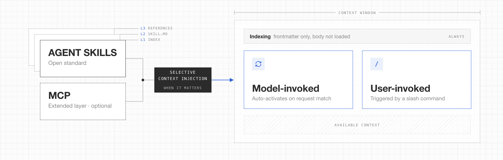

<a id="top"></a>



<div align="center">

Agent Skills. **Built by you, run by agents**. Learn more about the open standard at [Agent Skills](https://agentskills.io/home).

Skills define how the agent works. MCP servers extend its context on demand with tools and live data. Together they form the agent profile available in every session.

</div>

## Agent Skills <sup><small>[⌃](#top)</small></sup>

Skills are either **Model-invoked**, where the agent activates them when your request matches, or **User-invoked** via a slash command like `/triage`.

### Model-invoked

- [git-stack-flow](skills/git-stack-flow/): Commit/branch conventions, PR flow, and worktree audit
- [eng-principles](skills/eng-principles/): Design and verification principles for code
- [tests-by-contract](skills/tests-by-contract/): Authoring gate and audit for test value
- [typescript-magician](skills/typescript-magician/): Complex generics, type guards, and strict typing, by [Matteo Collina](https://github.com/mcollina)
- [motion-sense](skills/motion-sense/): Animation purpose, timing, and CSS technique
- [motion-engine](skills/motion-engine/): Performant animations with CSS, WAAPI, and Motion.dev
- [ui-baseline](skills/ui-baseline/): Type/spacing tokens, component patterns, and adaptive CSS

### User-invoked

- [triage](skills/triage/): GitHub issue and PR triage state machine
- [unslop](skills/unslop/): Strip AI tells and filler from writing, by [Lauren Tan](https://github.com/poteto)

## Commands <sup><small>[⌃](#top)</small></sup>

### Validate

`scripts/lint.sh` checks every skill against the SKILL.md spec. It runs in CI on each PR, or locally:

```bash
./scripts/lint.sh                  # lint all (name, description, format)
```

### Sync Upstream

`MANIFEST.yaml` tracks upstream sources. `scripts/sync.sh` overwrites your local copy from them. Use `--diff` to review first.

```bash
./scripts/sync.sh                  # sync all upstreams + update MANIFEST
./scripts/sync.sh --diff           # dry-run all, show what would change (new/changed/removed)
./scripts/sync.sh <skill>          # sync a single skill
./scripts/sync.sh <skill> --diff   # dry-run a single skill
```

## Extended Layer <sup><small>[⌃](#top)</small></sup>

- Type: **MCP** | [fff](https://github.com/dmtrKovalenko/fff)
- Type: **MCP** | [Chrome DevTools](https://github.com/ChromeDevTools/chrome-devtools-mcp)
- Type: **MCP** | [MDN](https://github.com/mdn/mcp)
